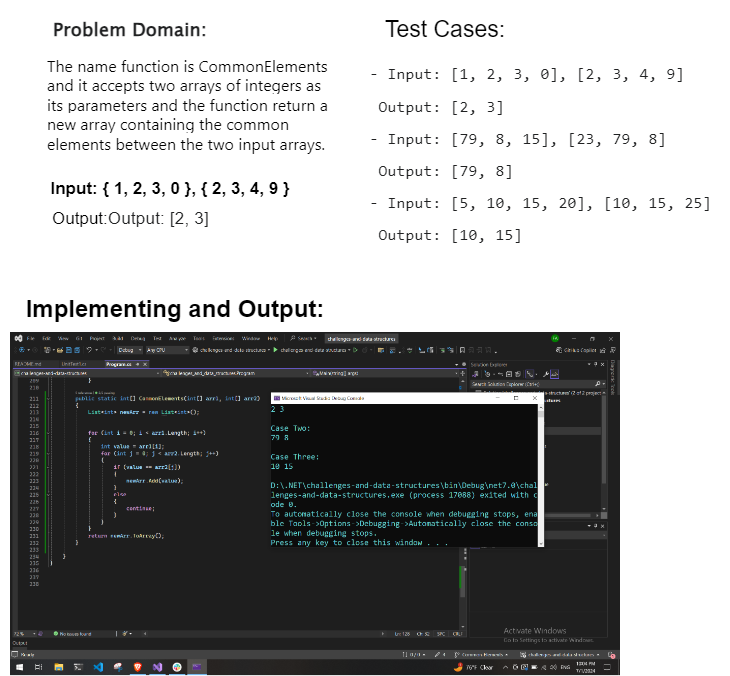

# Challenge 06-A: Common Elements

### Description:

The name function is CommonElements and it accepts two arrays of integers as its parameters and the function return a new array containing the common elements between the two input arrays.

