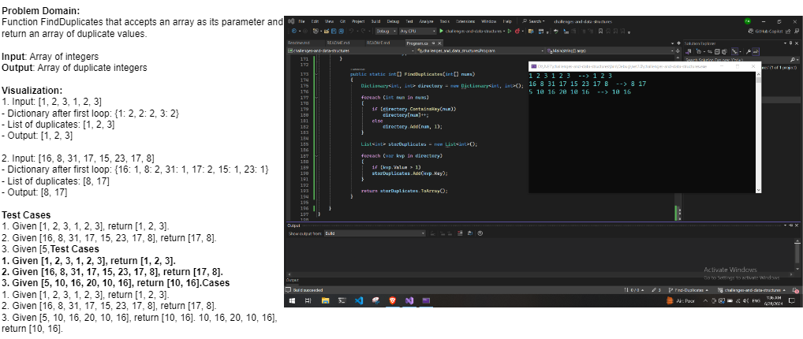

# Challenge 05: Find-Duplicates

#### Overview:
The `FindDuplicates` function identifies and returns all duplicate values in a given array of integers. This function is useful for detecting repeated elements in a dataset.

#### Parameters:
- `nums`: An array of integers. This array is the input for the function, and it will be scanned for duplicate values.

#### Returns:
- An array of integers containing the duplicate values found in the input array. If no duplicates are found, the function returns an empty array.

## Whiteboard

## Output:

