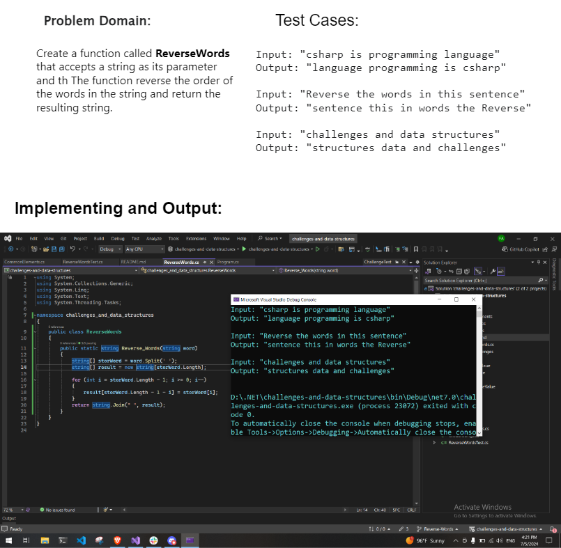
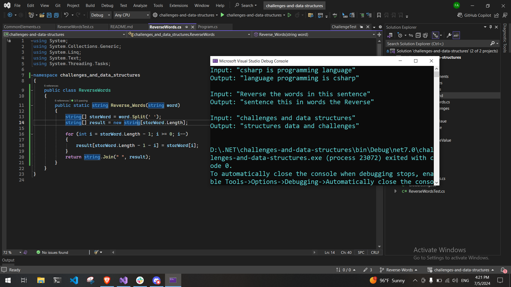

# Challenge 06-B: Reverse Words
Write a function called ReverseWords that accepts a string as its parameter. The function should reverse the order of the words in the string and return the resulting string. Words are defined as sequences of characters separated by spaces.

## Whitboard 

## The Code and Output
