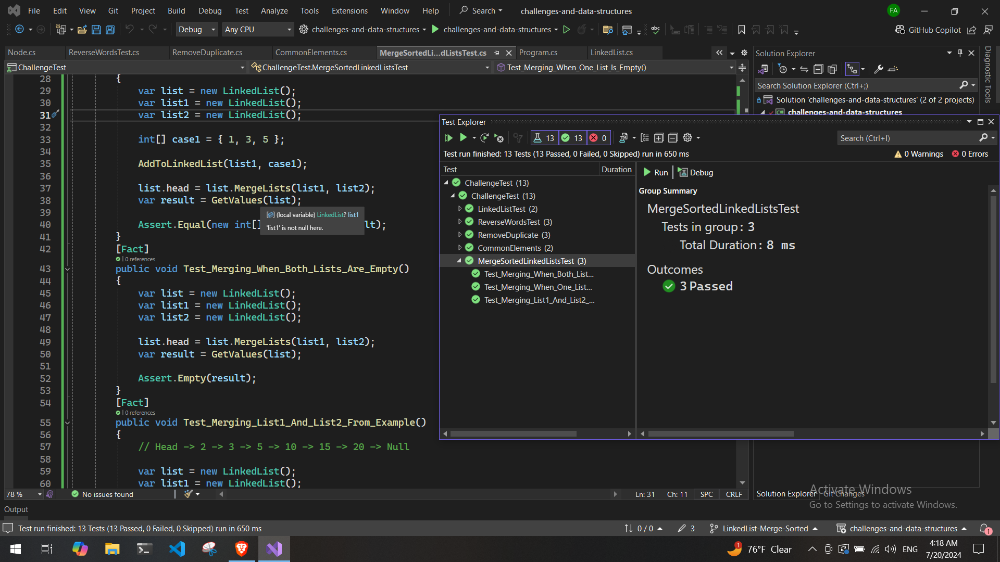

# Merge Sorted Linked Lists

### Problem Domain

Implement a method `MergeLists` that merges two linked lists into one. The method should handle cases where either or both of the lists are empty. The resulting list should concatenate the second list to the end of the first list.

## Whiteboard

## Output

## Testing
