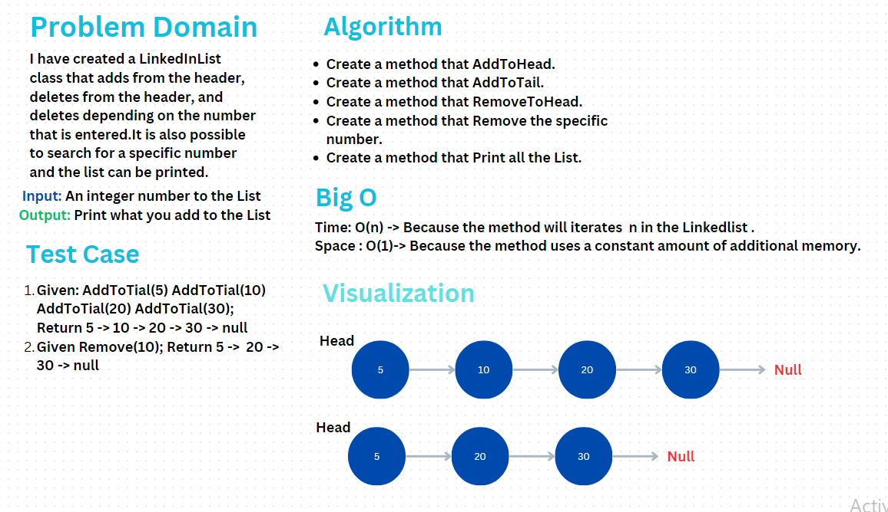

# LinkedList

### Problem Domain

I have created a LinkedInList class that adds from the header,
deletes from the header, and deletes depending on the number that is entered.
It is also possible to search for a specific number and the list can be printed.

### Whiteboard

