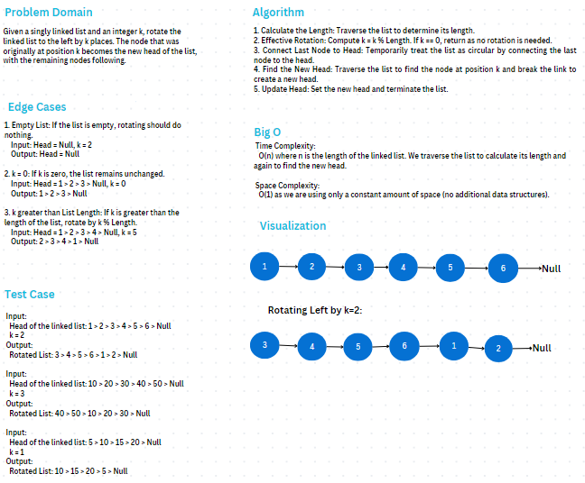
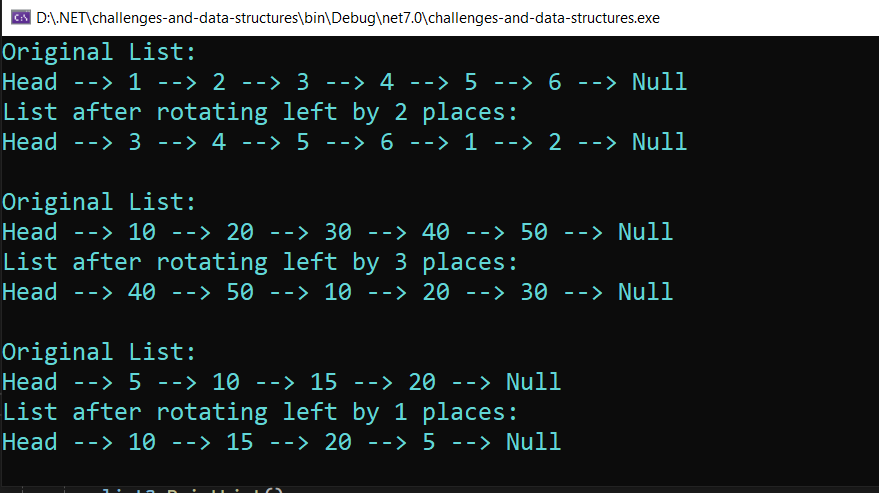

# Linked List Rotation

### Problem Domain
Given a singly linked list and an integer `k`, rotate the linked list
to the left by `k` places. The node that was originally at
position `k` becomes the newhead of the list, with the remaining nodes following.

### Whiteboard

### Output

