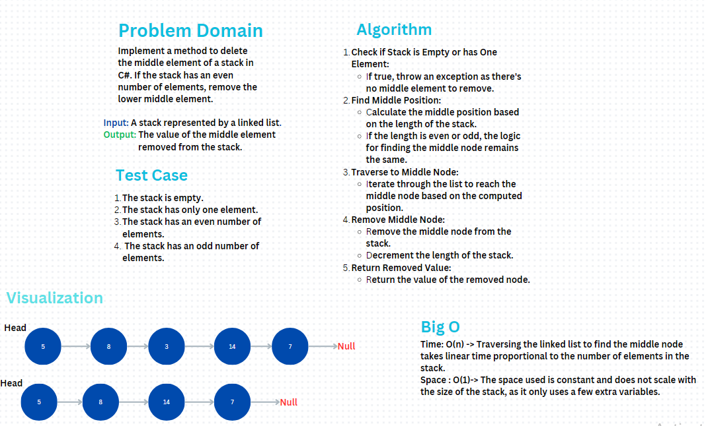

# Stack and Queue

### **Problem Domain**
Implement a method to delete the middle element of a stack in C#. If the stack has an even number of elements, remove the lower middle element.

## Whiteboard 

## Output

