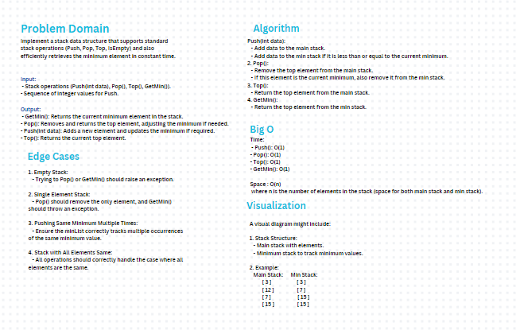

# Min Stack Challenge

### Problem Domain

Implement a stack data structure that supports standard stack operations (`Push`, `Pop`, `Top`, `IsEmpty`) and also efficiently retrieves the minimum element in constant time.

## Whiteboard 

## Output

