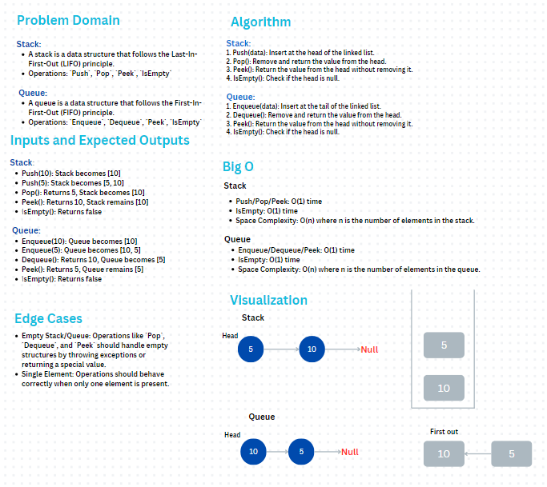
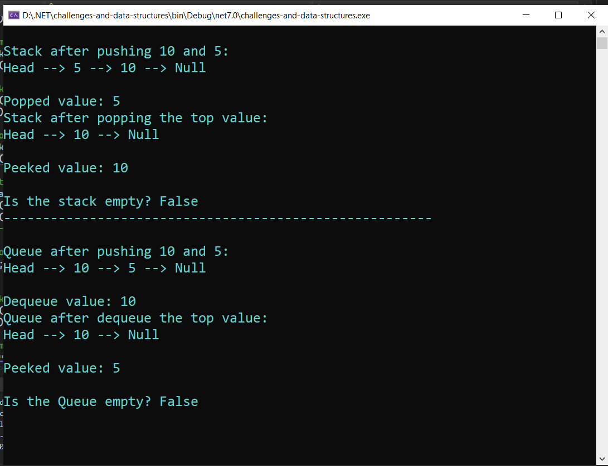

# Stack and Queue

### 1. **Problem Domain**

#### Stack:
- A stack is a data structure that follows the Last-In-First-Out (LIFO) principle.
- Operations: `Push`, `Pop`, `Peek`, `IsEmpty`

#### Queue:
- A queue is a data structure that follows the First-In-First-Out (FIFO) principle.
- Operations: `Enqueue`, `Dequeue`, `Peek`, `IsEmpty`

## Whiteboard 

## Output

