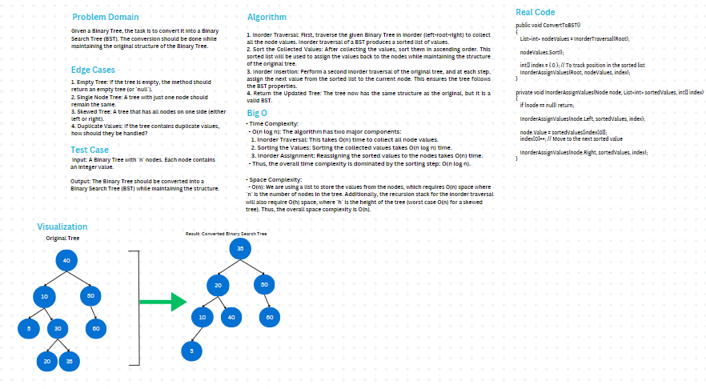

# Binary Tree to Binary Search Tree

### Problem Domain
Given a Binary Tree, the task is to convert it into a Binary Search Tree (BST). The conversion should be done while maintaining the original structure of the Binary Tree.

### Whiteboard
