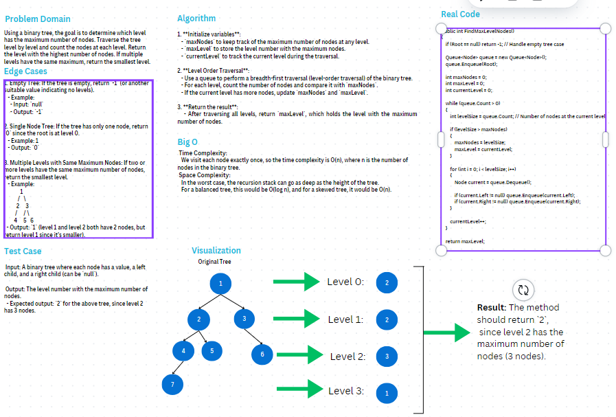

# Binary Tree - Level with Maximum Number of Nodes

# Problem Domain
Using a binary tree, the goal is to determine which level has the maximum number of nodes. Traverse the tree level by level and count the nodes at each level. Return the level with the highest number of nodes. If multiple levels have the same maximum, return the smallest level.

### Whiteboard

