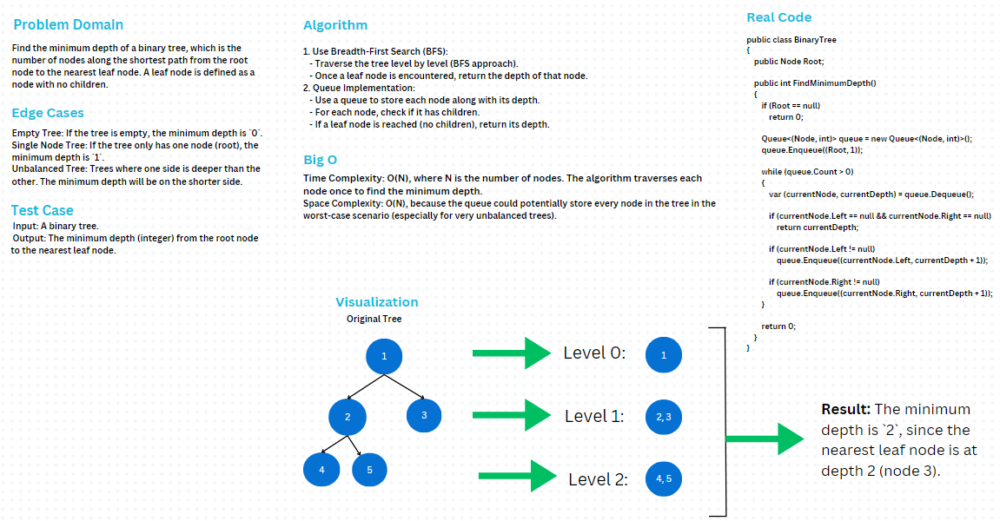

# Binary Tree - Minimum Depth

### Problem Domain
Find the minimum depth of a binary tree, which is the number of nodes along the shortest path from the root node to the nearest leaf node. A leaf node is defined as a node with no children.

