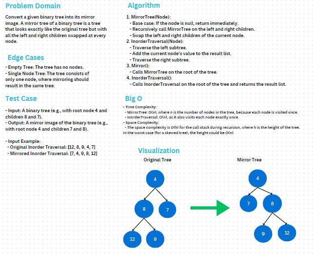

# Binary Tree - Mirror Tree

### Problem Domain  
Convert a given binary tree into its mirror image. A mirror tree of a binary tree is a tree that looks exactly like the original tree but with all the left and right children swapped at every node.

### Whiteboard

