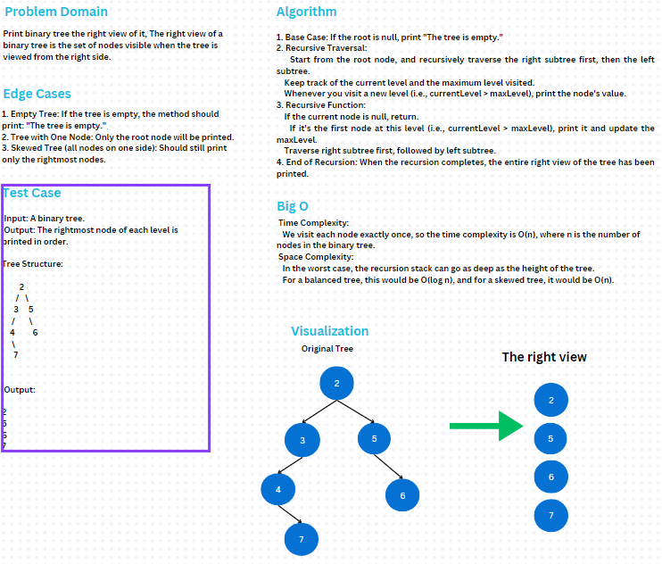

# Binary Tree Right View

This challenge implements a binary tree with various
traversal methods, including functionality to print the
**right view** of the binary tree. The right view is the set of nodes
visible when the tree is viewed from the right side.

### Whiteboard 
