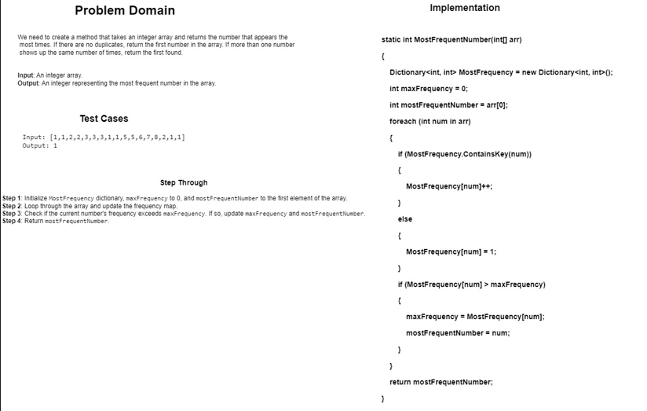
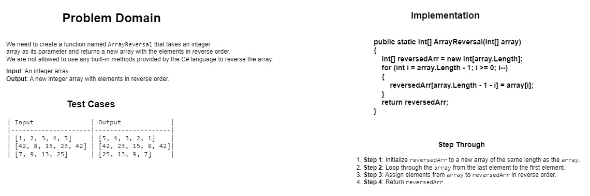

### Whiteboard Images

### Challenge A: Array Reversal

#### The Array Reversal challenge involves creating a function that accepts an array as its parameter and returns a new array where the elements are in reverse order. The key requirement is to achieve this without using any built-in methods provided by the C# language. This challenge tests the ability to manipulate arrays and implement custom algorithms to reverse the elements of the input array.

### Challenge B: Most Frequent Number

#### The Most Frequent Number challenge requires the creation of a method that takes an integer array as input and returns the number that appears the most times. If there are no duplicates, the first number in the array should be returned. In cases where more than one number shows up the same number of times, the first found number is to be returned. This challenge typically involves implementing a solution that efficiently counts the frequency of each number in the array and identifies the most frequently occurring number.
