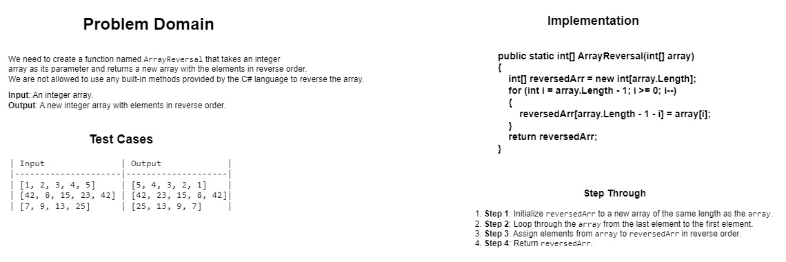
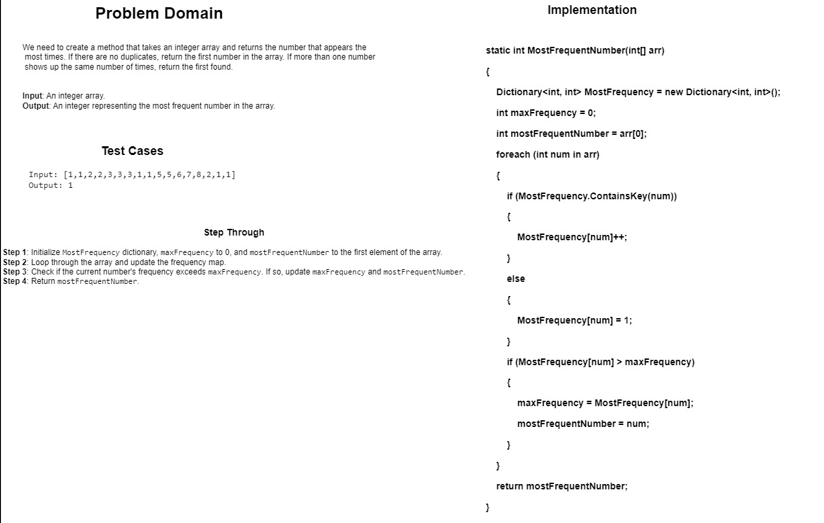
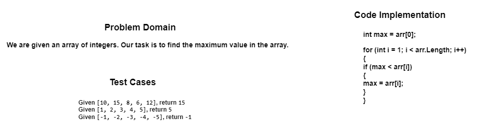
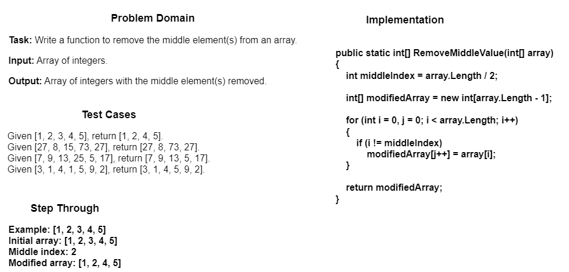
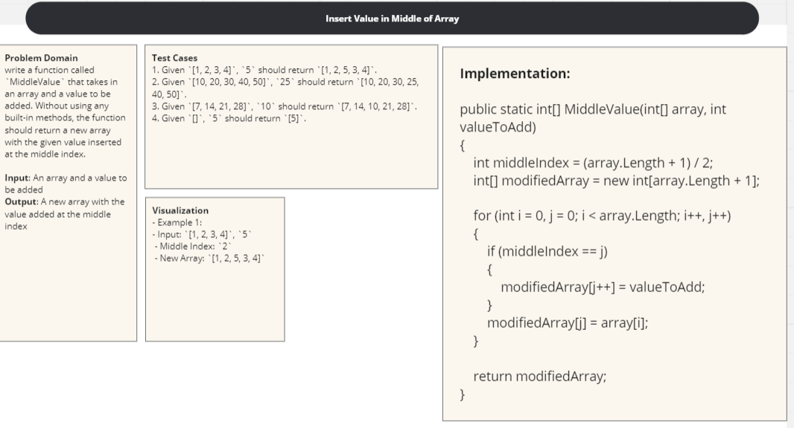
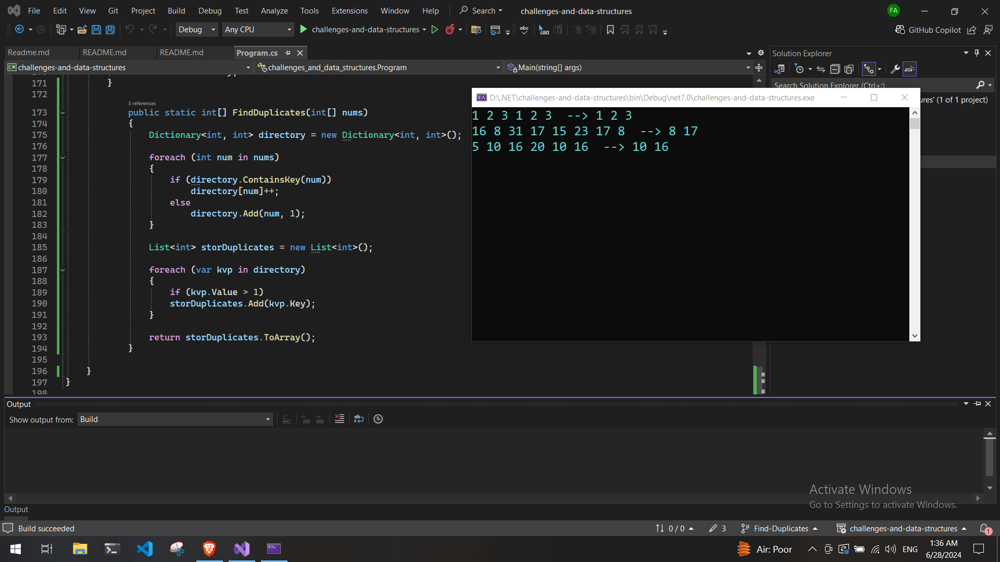

### Whiteboard Images

### Challenge A: Array Reversal

[Go To README](https://github.com/FadiAlNajar20/challenges-and-data-structures/tree/master/whiteboard-challenges/ArrayReversal#challenge-a-array-reversal)

### Challenge B: Most Frequent Number

[Go To README](https://github.com/FadiAlNajar20/challenges-and-data-structures/tree/master/whiteboard-challenges/MostFrequent#challenge-b-most-frequent-number)

### Challenge 02: Maximum Value

[Go To README](./whiteboard-challenges/MaximumValue/README.md)

### Challenge 03: Remove Middle Value

[Go To README](./whiteboard-challenges/RemoveMiddleValue/README.md)

### Challenge 04: Insert Middle Value

[Go To README](./whiteboard-challenges/InsertMiddleVlaue/README.md)

### Challenge 05: Find-Duplicates

[Go To README](./Challenges/Find-Duplicates/README.md)

# Challenge 06-A: Common Elements
[Go To README](./Challenges/Common-Elements/README.md)

# Challenge 06-B: Reverse Words
[Go To README](./Challenges/Reverse-Words/README.md)

# Linked List Implementation
[Go To README](./DataStructures/LinkedList/README.md)

# Linked List Remove Duplicates
[Go To README](./DataStructures/LinkedList/RemoveDuplicates/README.md)

# Merge Sorted Linked Lists
[Go To README](./DataStructures/LinkedList/MergeSorted/README.md)

# Stack & Queue
[Go To README](./DataStructures/Stack&Queue/README.md)

# Reversing a Stack Using a Queue
[Go To README](./DataStructures/Stack&Queue/ReverseStackUsingQueue/README.md)

# Min Stack Challenge
[Go To README](./DataStructures/Stack&Queue/MisStack/README.md)

# Binary Tree - Sum of leaf nodes
[Go To README](./DataStructures/Trees/LeafSum/README.md)

# Binary Tree - Largest Value at Each Level
[Go To README](./DataStructures/Trees/LargestValueAtEachLevel/README.md)

# Linked List Rotation
[Go To README](./DataStructures/LinkedList/RotateLinkedList/README.md)

# Binary Tree Right View
[Go To README](./DataStructures/Trees/RightViewPrint/README.md)